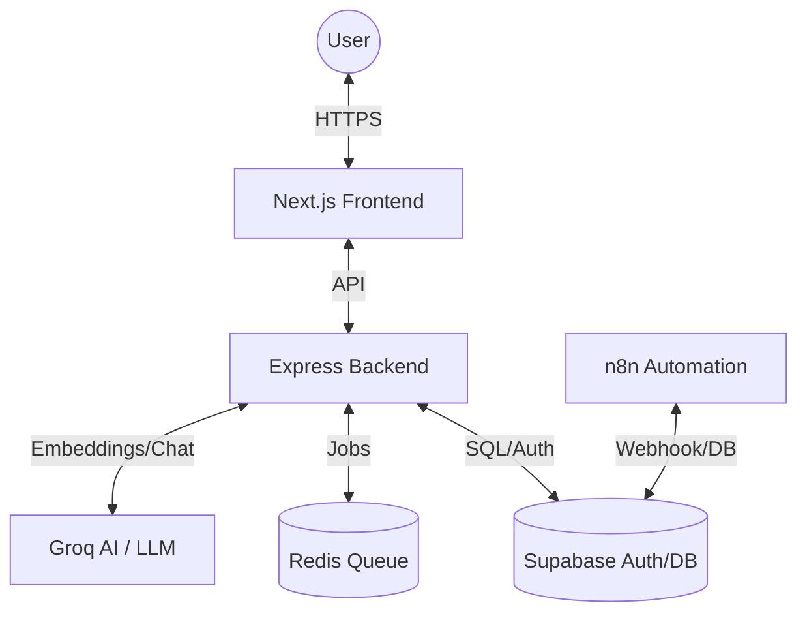

# TechVault | AI-Powered Smart Shopping Platform

TechVault is an AI-powered tech product discovery platform that leverages AI for semantic product discovery and background processing for order management. Built with a focus on speed, scalability, and user experience.

---

# 🏗 System Architecture



---

# Tech Stack

# Frontend
- **Framework**: [Next.js 16 (App Router)](https://nextjs.org/)
- **State & Auth**: [@supabase/ssr](https://supabase.com/docs/guides/auth/server-side/nextjs)
- **Styling**: [Tailwind CSS 4](https://tailwindcss.com/)
- **Icons**: [Lucide React](https://lucide.dev/)

### Backend
- **Server**: [Node.js / Express](https://expressjs.com/)
- **Language**: [TypeScript](https://www.typescriptlang.org/)
- **Queueing**: [BullMQ](https://docs.bullmq.io/)
- **Redis Client**: [IORedis](https://github.com/luin/ioredis)
- **AI Engine**: [Groq SDK](https://groq.com/) (Llama 3 & Nomic Embeddings)

### Infrastructure & Automation
- **Database**: PostgreSQL (via Supabase) with pgvector
- **Automation**: [n8n](https://n8n.io/) (Dockerized)

---

## Project Structure

```text
ShopSense/
├── shopsense/
│   ├── backend/             # Express server & TypeScript logic
│   │   ├── src/
│   │   │   ├── queues/      # BullMQ workers (Order confirmation, etc.)
│   │   │   ├── routes/      # AI Search & API endpoints
│   │   │   └── middleware/  # Auth & Validation
│   ├── frontend/            # Next.js 16 Web Application
│   │   ├── src/
│   │   │   ├── app/         # App Router (Login, Main pages)
│   │   │   ├── components/  # AISearch, ProductCard
│   │   │   └── lib/         # Supabase clients
└── .env                     # Root Environment Configuration
```

---

## 🛠 Features Breakdown

### 1. AI-Powered Semantic Search
Unlike traditional keyword search, TechVault uses **Vector Embeddings** to understand intent.
- **Flow**: User Query → Nomic Embedding → Supabase Vector Match → Llama 3 Personalization → UI.
- **Code**: [search.ts](file:///c:/Portfolio%20Projects/ShopSense/shopsense/backend/src/routes/search.ts)

### 2. Background Order Processing
Orders are processed asynchronously to maintain high performance.
- **Flow**: Checkout → BullMQ Job → Redis → Order Worker → Email Confirmation.
- **Code**: [orderQueue.ts](file:///c:/Portfolio%20Projects/ShopSense/shopsense/backend/src/queues/orderQueue.ts)

### 3. Integrated Auth Flow
Secure authentication using Supabase OIDC and Email/Password.
- **Redirects**: Managed via Next.js middleware and Supabase Auth Helpers.
- **Code**: [page.tsx](file:///c:/Portfolio%20Projects/ShopSense/shopsense/frontend/src/app/login/page.tsx)

---

## Ports

- Frontend: 3000
- Backend: 4000
- Supabase: 5432
- n8n: 5678

### Environment Setup
Copy the variables into your `.env` files (Root, Backend, and Frontend):

| Variable | Description |
| :--- | :--- |
| `SUPABASE_URL` | Supabase project URL |
| `SUPABASE_ANON_KEY` | Public key for frontend auth |
| `SUPABASE_SERVICE_KEY` | Secret key for backend/n8n admin access |
| `GROQ_API_KEY` | API key from Groq console |
| `REDIS_URL` | Connection string for BullMQ |

### Execution
1. **Infrastructure**:
   ```bash
   docker run -it --rm -p 5678:5678 n8nio/n8n
   ```
2. **Backend**:
   ```bash
   npm run dev  # in /shopsense/backend
   ```
3. **Frontend**:
   ```bash
   npm run dev  # in /shopsense/frontend
   ```

---

## 🛡 Security
- **Backend**: Protected by `helmet` for secure headers and `cors` for origin restriction.
- **Auth**: Service-to-service communication uses the `SUPABASE_SERVICE_KEY`, while client calls use scoped JWTs.

---
*Documentation Generated: 2026-04-08*
