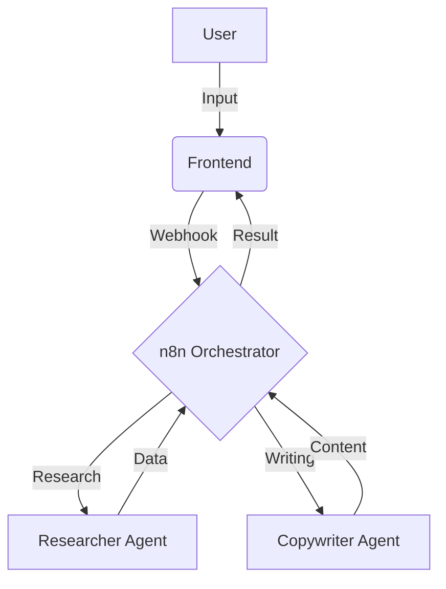

# TechVault System Design & Engineering Guidelines

## 🎯 Purpose
To maintain a professional engineering standard for the TechVault ecosystem. These guidelines ensure that as the "Virtual Office" (AI Agent Network) grows, the system remains scalable, debuggable, and well-documented.

---

## 🏗️ Core Engineering Artifacts
To track the project like an engineer, every major feature should be backed by these seven artifacts:

### 1. High-Level Architecture (C4 Model)
*   **Focus**: System boundaries and external integrations.
*   **Components**: Frontend (React), Backend (Express), Database (PostgreSQL), n8n Orchestration Layer, and External APIs (GSMArena, OpenAI, etc.).
*   **Tracking**: Use this to identify single points of failure.

### 2. Entity Relationship Diagram (ERD)
*   **Focus**: Data persistence and schema relationships.
*   **Key Tables**: `products`, `specs`, `categories`, `agent_tasks`, `users`.
*   **Tracking**: Ensure all agent outputs have a structured home in the DB.

### 3. Agent Orchestration (Sequence Diagrams)
*   **Focus**: Logic flow and timing between services.
*   **Workflow**: Trigger → n8n Researcher → Data Validation → n8n Copywriter → Frontend Sync.
*   **Tracking**: Essential for debugging "silent failures" in the agent chain.

### 4. API Specification (OpenAPI/Swagger)
*   **Focus**: The contract between services.
*   **Requirement**: Define request/response schemas for all n8n webhooks.
*   **Tracking**: Prevents "Interface Mismatch" errors between Backend and n8n.

### 5. Infrastructure & Deployment Map
*   **Focus**: Containerization and networking.
*   **Stack**: Docker, Docker Compose, n8n volumes, Environment Variables.
*   **Tracking**: Documents how to reproduce the entire environment locally.

### 6. UI State Machine
*   **Focus**: Managing complex frontend states.
*   **States**: `IDLE` → `RESEARCHING` → `GENERATING_CONTENT` → `REVIEW_REQUIRED` → `SYNCED`.
*   **Tracking**: Prevents UI bugs where multiple agents try to update the same field simultaneously.

### 7. Component Architecture Map
*   **Focus**: React component hierarchy and props flow.
*   **Tracking**: Guides the refactoring of large components (like `ProductModal.tsx`) into smaller, reusable units.

---

## 🛠️ Implementation Standards

### 📊 Diagrams as Code (Mermaid.js)
Whenever possible, embed diagrams directly in Markdown files using Mermaid syntax. This allows diagrams to be version-controlled via Git.

**Example:**

### 📂 Documentation Location
*   All technical specs: `techvault-admin/docs/`
*   Task tracking: `techvault-admin/docs/TASKS.MD`
*   System design: `techvault-admin/docs/SYSTEM_DESIGN_GUIDELINES.MD`

---

## 🚀 Engineering Mindset
1.  **Fail Loudly**: Agents should return clear error codes, not empty strings.
2.  **Stateless Agents**: n8n workflows should be idempotent whenever possible.
3.  **Data First**: Design the database schema before building the UI.
4.  **Traceability**: Every AI-generated field should have a "Source" or "Confidence Score" metadata.
