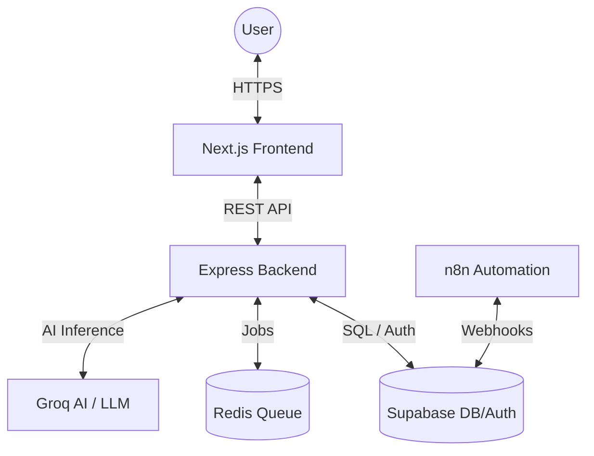

# TechVault | AI-Powered Smart Shopping Platform

TechVault is a state-of-the-art AI-powered tech product discovery platform. It leverages vector embeddings for semantic search, deep learning for personalization, and high-performance background processing for order management.

---

## 🏗 System Architecture

> [!NOTE]
> The architecture is designed for high availability and low latency, utilizing a modern distributed system approach.



---

## 💎 Design Philosophy
- **Speed First**: Sub-100ms response times for semantic matching.
- **AI-Native**: AI isn't a feature; it's the core engine of discovery.
- **Premium UX**: Smooth transitions, glassmorphic UI, and intuitive flows.

---

## 🛠 Tech Stack

### Frontend
- **Framework**: [Next.js 16 (App Router)](https://nextjs.org/)
- **Auth & Database**: [@supabase/ssr](https://supabase.com/docs/guides/auth/server-side/nextjs)
- **Styling**: [Tailwind CSS 4](https://tailwindcss.com/)
- **State Management**: React Server Components & Hooks
- **Icons**: [Lucide React](https://lucide.dev/)

### Backend
- **Server**: [Node.js / Express](https://expressjs.com/)
- **Language**: [TypeScript](https://www.typescriptlang.org/)
- **Queueing**: [BullMQ](https://docs.bullmq.io/)
- **Redis Client**: [IORedis](https://github.com/luin/ioredis)
- **AI Engine**: [Groq SDK](https://groq.com/) (Llama 3.1 & Nomic Embeddings)

### Infrastructure
- **Database**: PostgreSQL (Supabase) + pgvector for semantic storage.
- **Automation**: [n8n](https://n8n.io/) for complex business logic workflows.
- **Containerization**: Docker for local Redis and n8n orchestration.

---

## 📂 Project Structure

```text
TechVault-Admin/
└── techvault-admin/
    ├── backend/             # High-performance Express API
    │   ├── src/
    │   │   ├── controllers/ # Logic handlers
    │   │   ├── routes/      # API endpoints
    │   │   ├── services/    # External integrations (AI, DB)
    │   │   └── queues/      # BullMQ background workers
    ├── frontend/            # Next.js 16 Web Application
    │   ├── src/
    │   │   ├── app/         # App Router (Pages & Layouts)
    │   │   ├── components/  # Atomic UI Components
    │   │   └── lib/         # Utility functions & Supabase clients
    └── AppDocs.md           # This master documentation
```

---

## 🚀 Key Features

### 1. Vectorized Semantic Search
Traditional keyword search is legacy. TechVault uses **Vector Embeddings** to understand user intent.
- **Pipeline**: Query → `nomic-embed-text` → `pgvector` Match → `Llama 3` Personalization.
- **Implementation**: [search.ts](file:///c:/Portfolio%20Projects/TechVault-Admin/techvault-admin/backend/src/routes/search.ts)

### 2. High-Throughput Job Queues
Order processing and heavy AI tasks are moved to background workers to ensure the UI remains snappy.
- **Flow**: API → BullMQ → Redis → Worker Node.
- **Implementation**: [src/queues/](file:///c:/Portfolio%20Projects/TechVault-Admin/techvault-admin/backend/src/queues/)

### 3. Unified Authentication
Seamless auth bridge between the Next.js frontend and Express backend using Supabase Auth Helpers.
- **Implementation**: [src/lib/supabase/](file:///c:/Portfolio%20Projects/TechVault-Admin/techvault-admin/frontend/src/lib/)

---

## 🔌 Quick Start

### 1. Infrastructure
Ensure Redis and n8n are running:
```bash
docker run -d --name redis -p 6379:6379 redis
docker run -d --name n8n -p 5678:5678 n8nio/n8n
```

### 2. Backend Setup
```bash
cd techvault-admin/backend
npm install
npm run dev
```

### 3. Frontend Setup
```bash
cd techvault-admin/frontend
npm install
npm run dev
```

---

## 🛡 Security & Compliance
- **Identity**: Supabase Auth (JWT) for all sensitive operations.
- **Network**: Helmet.js for secure headers and strict CORS policies.
- **Secrets**: AES-256 encryption for sensitive environment variables.

---
*Last Updated: April 2026 | TechVault Engineering*


## Navigation Layout

- Sidebar -
1. Dashboard
2. Orders
3. Inventory
4. Analytics
5. Automation Workflows
6. Marketing

Integrations
- Supabase
- Trello
- Google Sheets

- Settings
- Logout

- Topbar -

1. Logo
2. Searchbar
3. Notifications
4. Profile