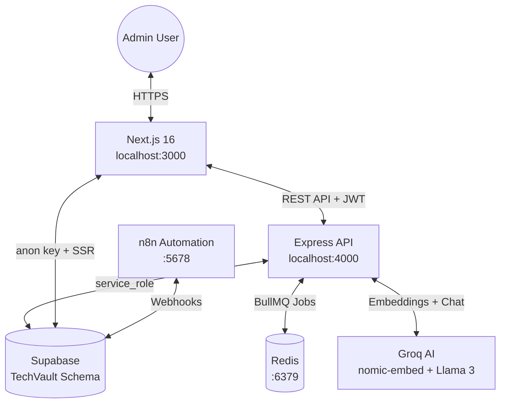

# TechVault Admin | System Documentation

> TechVault is an AI-powered tech product administration platform. This document covers the full-stack architecture, setup, configuration, and operational guides for the entire `techvault-admin` monorepo.

---

## 📋 Table of Contents

1. [System Overview](#-system-overview)
2. [Architecture Diagram](#-architecture-diagram)
3. [Monorepo Structure](#-monorepo-structure)
4. [Tech Stack](#-tech-stack)
5. [Quick Start Guide](#-quick-start-guide)
6. [Database: Supabase Schema Setup](#-database-supabase-schema-setup)
7. [Environment Variables Reference](#-environment-variables-reference)
8. [Key Features](#-key-features)
9. [Admin Navigation Layout](#-admin-navigation-layout)
10. [Security Model](#-security-model)
11. [Common Issues & Fixes](#-common-issues--fixes)

---

## 🎯 System Overview

TechVault Admin is a **full-stack monorepo** composed of two independently running applications:

| App | Technology | Port | Purpose |
|-----|-----------|------|---------|
| **Frontend** | Next.js 16, React 19, Tailwind 4 | `3000` | Admin UI — dashboards, inventory, orders |
| **Backend** | Node.js, Express 5, TypeScript | `4000` | REST API — CRUD, AI search, queue jobs |

Both are connected to a **Supabase PostgreSQL** database via the `TechVault` custom schema. The backend uses an AI layer (Groq) for semantic search and a BullMQ/Redis queue for background job processing.

---

## 🏗 Architecture Diagram



**Data flow for CRUD operations:**
```
Admin UI (localhost:3000)
  → fetch() to Express API (localhost:4000)
    → supabase.schema('TechVault').from('Products')
      → Supabase PostgreSQL
```

---

## 📂 Monorepo Structure

```text
TechVault-Admin/
└── techvault-admin/
    ├── backend/                       # Express REST API
    │   ├── src/
    │   │   ├── index.ts               # Server entry point
    │   │   ├── app.ts                 # Express app & middleware config
    │   │   ├── controllers/           # Request handlers (product, search)
    │   │   ├── routes/                # URL → controller mappings
    │   │   ├── services/              # External integrations (Supabase, Groq AI)
    │   │   ├── middleware/            # Auth guard & error handler
    │   │   ├── queues/                # BullMQ background job workers
    │   │   └── scripts/              # One-time admin scripts (embed products)
    │   ├── .env                       # Backend secrets ← never commit
    │   ├── setup_database.sql         # Supabase table creation SQL
    │   └── Backend.md                 # Backend-specific documentation
    │
    ├── frontend/                      # Next.js Admin Panel
    │   ├── src/
    │   │   ├── app/                   # App Router pages & layouts
    │   │   │   ├── layout.tsx         # Root layout (Navbar, Sidebar)
    │   │   │   ├── page.tsx           # Dashboard page
    │   │   │   ├── globals.css        # Global styles & Tailwind tokens
    │   │   │   └── pages/
    │   │   │       └── Inventory/
    │   │   │           └── Inventory.tsx  # Product CRUD interface
    │   │   └── lib/
    │   │       └── supabase/          # Browser & server Supabase clients
    │   ├── .env.local                 # Frontend env vars ← never commit
    │   └── Frontend.md                # Frontend-specific documentation
    │
    └── AppDocs.md                     # This master system documentation
```

---

## 🛠 Tech Stack

### Frontend
| Technology | Version | Purpose |
|-----------|---------|---------|
| Next.js | 16.2.2 | React framework with App Router & SSR |
| React | 19.2.4 | UI rendering |
| Tailwind CSS | 4 | Utility-first styling |
| @supabase/ssr | 0.10 | Server-side auth session management |
| @supabase/supabase-js | 2.x | Supabase client for auth |
| Lucide React | 1.x | Icon library |
| TypeScript | 5.x | Type safety |

### Backend
| Technology | Version | Purpose |
|-----------|---------|---------|
| Express | 5.x | HTTP server framework |
| TypeScript | 6.x | Type safety |
| @supabase/supabase-js | 2.x | Database access (service_role) |
| Groq SDK | 1.x | AI inference (embeddings + LLM) |
| BullMQ | 5.x | Redis-backed background job queues |
| IORedis | 5.x | Redis client for BullMQ |
| Helmet | 8.x | HTTP security headers |
| Zod | 4.x | Runtime schema validation |
| Nodemon | 3.x | Hot reload for development |

### Infrastructure
| Service | Purpose |
|---------|---------|
| Supabase (PostgreSQL) | Primary database with pgvector for AI search |
| Redis | Job queue backing store |
| Groq Cloud | AI embeddings (`nomic-embed-text-v1`) and LLM (`llama3-70b-8192`) |
| n8n | Automation workflows and webhook integrations |

---

## 🚀 Quick Start Guide

### Prerequisites
- Node.js v18+
- npm v9+
- Docker (for Redis and n8n, optional)
- A Supabase project with the `TechVault` schema created

### Step 1 — Clone & Install

```powershell
# Install root dependencies (if any)
npm install

# Install backend dependencies
cd techvault-admin/backend
npm install

# Install frontend dependencies
cd ../frontend
npm install
```

### Step 2 — Configure Environment Variables

**Backend** — create `techvault-admin/backend/.env`:
```env
SUPABASE_URL=https://<ref>.supabase.co
SUPABASE_SERVICE_KEY=eyJ...          # service_role key from Supabase Dashboard
PORT=4000
GROQ_API_KEY=gsk_...
REDIS_URL=redis://localhost:6379     # optional — needed for order queue
```

**Frontend** — create `techvault-admin/frontend/.env.local`:
```env
NEXT_PUBLIC_SUPABASE_URL=https://<ref>.supabase.co
NEXT_PUBLIC_SUPABASE_ANON_KEY=sb_publishable_...  # anon/publishable key
NEXT_PUBLIC_API_URL=http://localhost:4000
```

### Step 3 — Set Up Supabase

1. Open **Supabase Dashboard** → **Project Settings** → **API** → **Extra schemas**
2. Add `TechVault` and save.
3. Go to **SQL Editor** and run the following grants:

```sql
GRANT USAGE ON SCHEMA "TechVault" TO service_role;
GRANT ALL ON ALL TABLES IN SCHEMA "TechVault" TO service_role;
GRANT ALL ON ALL SEQUENCES IN SCHEMA "TechVault" TO service_role;
```

4. If the `TechVault.Products` table doesn't exist yet, run `setup_database.sql`.

### Step 4 — Start Infrastructure (Optional)

```powershell
# Start Redis for background job queues
docker run -d --name redis -p 6379:6379 redis

# Start n8n for automation workflows
docker run -d --name n8n -p 5678:5678 n8nio/n8n
```

### Step 5 — Start the Servers

```powershell
# Terminal 1 — Backend
cd techvault-admin/backend
npm run dev          # → http://localhost:4000

# Terminal 2 — Frontend
cd techvault-admin/frontend
npm run dev          # → http://localhost:3000
```

---

## 🗄 Database: Supabase Schema Setup

All product data lives in the `TechVault` custom Postgres schema (not the default `public` schema).

### Products Table

```sql
CREATE TABLE IF NOT EXISTS "TechVault"."Products" (
  product_id   UUID         DEFAULT gen_random_uuid() PRIMARY KEY,
  name         TEXT         NOT NULL,
  description  TEXT,
  price        NUMERIC(10, 2) NOT NULL,
  brand        TEXT,
  category_id  UUID,
  stock        INTEGER      DEFAULT 0,
  rating       NUMERIC(3, 2) DEFAULT 0,
  embedding    vector(768),  -- for AI semantic search
  created_at   TIMESTAMPTZ  DEFAULT timezone('utc', now()) NOT NULL
);
```

### Semantic Search RPC (`match_products`)

Required for AI search functionality. Install `pgvector` extension first:
```sql
CREATE EXTENSION IF NOT EXISTS vector;

CREATE OR REPLACE FUNCTION public.match_products(
  query_embedding vector(768),
  match_count     int
)
RETURNS TABLE (
  product_id  uuid,
  name        text,
  description text,
  similarity  float
)
LANGUAGE sql STABLE AS $$
  SELECT
    product_id,
    name,
    description,
    1 - (embedding <=> query_embedding) AS similarity
  FROM "TechVault"."Products"
  ORDER BY embedding <=> query_embedding
  LIMIT match_count;
$$;
```

---

## 🔑 Environment Variables Reference

### Backend (`.env`)

| Variable | Required | Description |
|----------|----------|-------------|
| `SUPABASE_URL` | ✅ Yes | Your Supabase project URL |
| `SUPABASE_SERVICE_KEY` | ✅ Yes | Service role key — bypasses RLS. Backend only. |
| `PORT` | No | Server port (default: `4000`) |
| `GROQ_API_KEY` | ✅ Yes | Groq Cloud API key for AI features |
| `REDIS_URL` | For queues | Redis connection URL (e.g., `redis://localhost:6379`) |

### Frontend (`.env.local`)

| Variable | Required | Description |
|----------|----------|-------------|
| `NEXT_PUBLIC_SUPABASE_URL` | ✅ Yes | Your Supabase project URL |
| `NEXT_PUBLIC_SUPABASE_ANON_KEY` | ✅ Yes | Anon/publishable key — safe to expose |
| `NEXT_PUBLIC_API_URL` | No | Backend base URL (default: `http://localhost:4000`) |

> [!CAUTION]
> The `SUPABASE_SERVICE_KEY` **must never** appear in frontend code or any `NEXT_PUBLIC_` variable. It grants full unrestricted database access, bypassing all Row Level Security.

---

## ✨ Key Features

### 1. Product Inventory CRUD
Full create, read, update, and delete interface for the `TechVault.Products` table. Accessible at `/inventory` or via the Sidebar → Inventory.

- **Tech:** `Inventory.tsx` → Express API → `product.controller.ts` → Supabase

### 2. AI Semantic Search
Natural language product search powered by vector embeddings and LLM reasoning.

- **Pipeline:** User query → Groq `nomic-embed-text-v1` → `pgvector` `match_products()` → Groq `llama3-70b` → Frontend response
- **Tech:** `search.controller.ts` + `ai.service.ts`
- **Auth required:** Yes (JWT Bearer token)

### 3. Background Job Queue
Async order confirmation email processing using BullMQ + Redis.

- **Tech:** `orderQueue.ts` — drops jobs in Redis, Worker picks them up independently
- **To enable:** Implement `sendOrderEmail()` with Nodemailer or SendGrid

### 4. Supabase SSR Auth
Secure session management using HTTP-only cookies, preventing JWT exposure in `localStorage`.

- **Tech:** `@supabase/ssr` with `createServerClient()` in middleware and server components

---

## 🧭 Admin Navigation Layout

### Sidebar
1. **Dashboard** — KPI cards, revenue charts, recent orders
2. **Orders** — Order management table
3. **Inventory** — ✅ Product CRUD (fully implemented)
4. **Analytics** — Sales and traffic insights
5. **Automation Workflows** — n8n integration hub
6. **Marketing** — Campaign management

**Integrations Panel:**
- Supabase (database & auth)
- Trello (task boards)
- Google Sheets (reporting export)

### Topbar
1. **Logo** — TechVault branding
2. **Search Bar** — AI semantic product search
3. **Notifications** — Alert center
4. **Profile** — User account & logout

---

## 🛡 Security Model

| Layer | Implementation | Purpose |
|-------|---------------|---------|
| HTTP Headers | `helmet.js` | Prevents XSS, clickjacking, MIME sniffing |
| CORS | `cors()` middleware | Restricts cross-origin access |
| Authentication | Supabase JWT verification | Validates user identity on protected routes |
| Authorization | Row Level Security (RLS) | Limits what anon/authenticated users can do |
| Secret isolation | Service key in backend only | Frontend never sees unrestricted DB access |
| Input validation | `Zod` schemas | Prevents malformed data reaching the database |

**Auth middleware flow:**
```
Request → Authorization: Bearer <token>
  → requireAuth middleware
    → supabase.auth.getUser(token)
      → ✅ valid: req.user = user, next()
      → ❌ invalid: 401 Unauthorized
```

---

## 🚨 Common Issues & Fixes

| Error Message | Root Cause | Fix |
|---------------|-----------|-----|
| `Invalid schema: TechVault` | Schema not exposed in Supabase API | Dashboard → API Settings → Extra Schemas → add `TechVault` |
| `permission denied for schema TechVault` | `service_role` lacks schema access | Run `GRANT USAGE ON SCHEMA "TechVault" TO service_role;` |
| `Could not find the table 'TechVault.Products'` | Table doesn't exist | Run `setup_database.sql` in Supabase SQL Editor |
| `TypeError: fetch failed` on backend | Wrong `SUPABASE_URL` | Make sure it matches your actual Supabase project URL |
| `Failed to fetch products` on frontend | Backend not running or wrong `API_URL` | Run `npm run dev` in `/backend`, check `NEXT_PUBLIC_API_URL` |
| `Cannot GET /` on backend | No root route | Fixed — `GET /` now returns "TechVault API is running" |
| `REDIS_URL` connection refused | Redis not running | Run `docker run -d --name redis -p 6379:6379 redis` |
| `Missing GROQ_API_KEY` | Key not in `.env` | Add `GROQ_API_KEY=gsk_...` to `backend/.env` |
| `Module not found '@/lib/...'` | Path alias missing | Check `tsconfig.json` for `"paths": { "@/*": ["./src/*"] }` |

---

*TechVault Admin | System Documentation | Last Updated: April 2026*